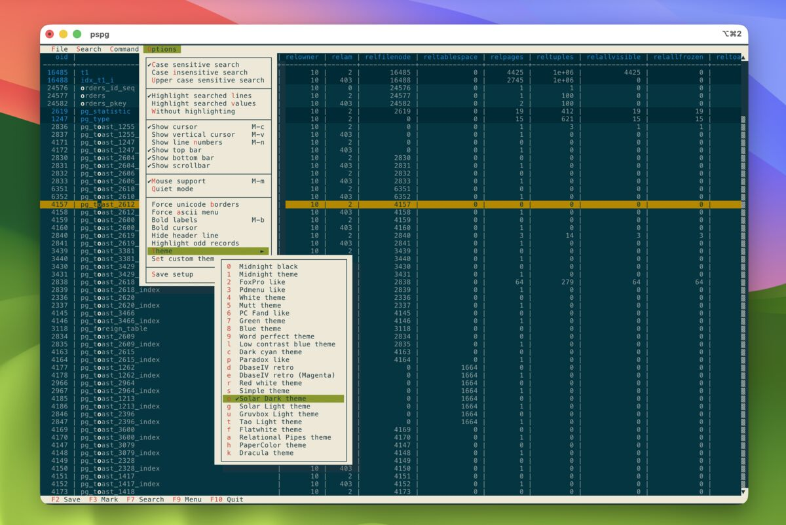

# rpg — modern Postgres terminal written in Rust


[](https://github.com/NikolayS/rpg/actions/workflows/ci.yml)
[](https://codecov.io/gh/NikolayS/rpg)
[](LICENSE)
[](https://www.rust-lang.org/)

A psql-compatible terminal written in Rust with built-in DBA diagnostics and AI assistant.
Single binary, no dependencies, cross-platform.

## Features

- **psql-compatible** — `\`-commands are standard psql meta-commands (`\d`, `\dt`, `\copy`, `\watch`, ...); `/`-commands are rpg extensions — both AI and non-AI. Same muscle memory, clearly distinct additions.
- **Active Session History** — `/ash` live wait event timeline with drill-down; pg_ash history integration
- **AI assistant** — `/ask`, `/fix`, `/explain`, `/optimize`, `/text2sql`, `/yolo`
- **DBA diagnostics** — 15+ `/dba` commands: activity, locks, bloat, indexes, vacuum, replication, config
- **Schema-aware completion** — tab completion for tables, columns, functions, keywords
- **Lua plugin system** — extend rpg with custom `/`-commands written in Lua
- **TUI pager** — scrollable pager for large result sets
- **Syntax highlighting** — SQL keywords, strings, operators; EXPLAIN plans; color-coded errors/warnings
- **Markdown output** — `\pset format markdown` for docs-ready table output
- **Named queries** — save and recall frequent queries
- **Session persistence** — history and settings preserved across sessions
- **Multi-host failover** — `-h host1,host2` tries each in order, first success wins
- **SSH tunnel** — connect through bastion hosts without manual port-forwarding
- **Config profiles** — per-project `.rpg.toml`
- **Shell backtick substitution** — dynamic prompts via `PROMPT1='[`git branch --show-current`] %/ # '`
- **Status bar** — connection info, transaction state, timing
- **Cross-platform** — single static binary: Linux, macOS, Windows (x86_64 + aarch64)

## Installation

Build the latest stable release from source (requires Rust 1.85+):

```bash
git clone --branch v0.10.2 --depth 1 https://github.com/NikolayS/rpg.git
cd rpg
cargo build --release
sudo cp ./target/release/rpg /usr/local/bin/
```

> **Note:** `main` is under active development and may be unstable. Pin to a
> release tag (e.g. `v0.10.2`) for a known-good build. Release notes:
> [github.com/NikolayS/rpg/releases](https://github.com/NikolayS/rpg/releases)

## Connect

```bash
# Same flags as psql
rpg -h localhost -p 5432 -U postgres -d mydb

# Connection string
rpg "postgresql://user@localhost/mydb"

# Non-interactive
rpg -d postgres -c "select version()"
```

On connect, rpg prints its version (with commit count and hash if built past a release tag), the full server version, AI status, and a reminder to type `\?` for help.

## Command convention

rpg uses two command namespaces:

| Prefix | Type | Examples |
|--------|------|---------|
| `\` | psql meta-commands — standard, unchanged | `\d`, `\dt`, `\l`, `\copy`, `\watch`, `\timing` |
| `/` | rpg extensions — AI and non-AI | `/fix`, `/explain`, `/ash`, `/dba`, `/ask` |

Anything that works in psql works here unchanged. Everything rpg adds uses `/`. Type `\?` to see the full list.

## AI assistant

Integrates with OpenAI, Anthropic, and Ollama:

```sql
-- Ask questions about your database
/ask What indexes should I add for my orders table?

-- Interpret EXPLAIN (ANALYZE, BUFFERS) output
select * from orders where status = 'pending';
/explain

-- Fix errors and optimize queries
/fix
/optimize
```

| Command | Description |
|---------|-------------|
| `/ask <prompt>` | Natural language to SQL |
| `/explain` | Interpret the last query plan |
| `/fix` | Diagnose and fix the last error |
| `/optimize` | Suggest query optimizations |
| `/describe <table>` | AI-generated table description |
| `/init` | Generate `.rpg.toml` and `POSTGRES.md` in current directory |
| `/clear` | Clear AI conversation context |
| `/compact [focus]` | Compact conversation context (optional focus topic) |
| `/budget` | Show token usage and remaining budget |

### /text2sql — natural language to SQL

By default, the generated SQL is shown in a preview box and you confirm before it runs:

```
postgres=# /text2sql
Input mode: text2sql
postgres=# what is DB size?
┌── sql
select pg_size_pretty(pg_database_size(current_database())) as db_size;
└───────
Execute? [Y/n/e]
 db_size
---------
 58 MB
(1 row)
```

### /yolo — fast natural-language mode

`/yolo` combines text2sql and silent auto-execute in one command: it enables
text2sql input, hides the SQL preview box, and executes immediately without
confirmation.

```
postgres=# /yolo
Execution mode: yolo
postgres=# what is DB size?
 db_size
---------
 58 MB
(1 row)
```

Toggle back with `/sql` or `/interactive`. Show/hide the SQL preview box with
`\set TEXT2SQL_SHOW_SQL on`.

<details>
<summary>▶ Click to expand demo</summary>


*`/t2s` shows a SQL preview with confirmation; `/yolo` skips the preview and executes immediately.*

</details>

### /fix — auto-correct errors

```
postgres=# select * fromm t1 where i = 10;
ERROR:  syntax error at or near "fromm"
LINE 1: select * fromm t1 where i = 10;
                 ^
Hint: Replace "fromm" with "from".
Hint: type /fix to auto-correct this query

postgres=# /fix
Corrected SQL query:
┌── sql
select * from t1 where i = 10;
└───────
Execute? [Y/n/e]
  i |             random
----+--------------------
 10 | 0.6895257944299762
(1 row)
```

<details>
<summary>▶ Click to expand demo</summary>


*`/fix` detects a misspelled table name, suggests the corrected query, and executes it after confirmation.*

</details>

### /optimize — index and performance suggestions

```
postgres=# /optimize
<runs EXPLAIN (ANALYZE, BUFFERS), then suggests:>

1. Create an Index on t1.i — parallel seq scan is inefficient for point lookups
   CREATE INDEX idx_t1_i ON public.t1 (i);
   Expected: 28ms → sub-millisecond

2. Run ANALYZE on t1 — statistics may be stale
   ANALYZE public.t1;
```

<details>
<summary>▶ Click to expand demo</summary>


*`/explain` interprets the query plan; `/optimize` suggests an index. After creating it, the same query runs dramatically faster.*

</details>

### Share EXPLAIN plans

Upload the last EXPLAIN plan to an external visualizer:

```
/explain-share depesz     → posts to explain.depesz.com
/explain-share dalibo     → posts to explain.dalibo.com
/explain-share pgmustard  → posts to pgMustard (requires PGMUSTARD_API_KEY)
```

### EXPLAIN display format

Toggle between enhanced and raw (psql-compatible) views:

```
\pset explain_format raw
\pset explain_format enhanced
\pset explain_format compact
```

## psql-compatible display settings

### \pset — display settings

```
postgres=# \pset null '∅'
Null display is "∅".
postgres=# select id, name, deleted_at from users limit 3;
 id | name  | deleted_at
----+-------+------------
  1 | Alice | ∅
  2 | Bob   | 2024-03-15
  3 | Carol | ∅
(3 rows)
```

### Markdown output

Switch to Markdown table format for easy copy-paste into docs or chat:

```
\pset format markdown
select id, name from customers limit 3;
| id | name       |
|----|------------|
| 1  | Sam Martin |
| 2  | Alice Zhou |
| 3  | Bob Patel  |
(3 rows)
```

Also available as a CLI flag: `rpg --markdown -c "select id, name from customers limit 3"`.

### External pager support

rpg includes a built-in TUI pager, but also supports external pagers like [pspg](https://github.com/okbob/pspg).
Switch in one command — no restart needed:

```
\set PAGER 'pspg --style=22'
```

Or set `PAGER=pspg` in your environment before launching rpg.
pspg adds horizontal scrolling (Right arrow), line numbers (Alt+n),
and a vertical column cursor (Alt+v) — useful for wide result sets.



*pspg with the theme selector menu — 20+ built-in themes, horizontal scrolling, column cursor.*

### \s — command history

Browse, search, and save your query history:

```
\s                  show full history (numbered, syntax-highlighted)
\s pattern          filter history by pattern
\s /path/to/file    save history to a file
```

### Lua custom commands

Extend rpg with custom meta-commands written in Lua. Build with `--features lua`,
then place `.lua` files in `~/.config/rpg/commands/`:

```lua
-- ~/.config/rpg/commands/slow_mean.lua
local rpg = require("rpg")

rpg.register_command({
    name = "slow_mean",
    description = "Top 10 slowest queries by avg time",
    handler = function()
        rpg.print(rpg.query([[
            select
                calls,
                round(mean_exec_time::numeric, 2) as avg_ms,
                left(query, 80) as query
            from pg_stat_statements
            order by mean_exec_time desc limit 10
        ]]))
    end,
})
```

Run the command with `/slow_mean`. List all loaded custom commands with `/commands`.

More examples are in the [`examples/commands/`](examples/commands/) directory.

## Active Session History


`/ash` opens a live wait event timeline — a scrolling stacked-bar chart of
active sessions grouped by wait event type, with drill-down to individual
events and queries.

```
postgres=# /ash
```

- **Timeline** — stacked bars scroll right-to-left, one bar per second (or
  wider buckets at higher zoom levels)
- **Drill-down** — `↑↓` to select a wait type, `Enter` to expand to events,
  `Enter` again to see queries
- **Zoom** — `←→` to change the time bucket (1s → 15s → 30s → 60s → 5min → 10min)
- **Legend** — `l` to toggle the color legend overlay
- **X-axis timestamps** — `HH:MM:SS` at zoom 1–2, `HH:MM` at coarser levels; anchors shift as time passes

<details>
<summary>▶ Click to expand — X-axis labels</summary>


</details>

When the [`pg_ash`](https://github.com/NikolayS/pg_ash) extension is
installed, the timeline pre-populates with historical data on startup —
bars appear immediately rather than building from scratch.

<details>
<summary>▶ Click to expand — pg_ash history pre-population</summary>


</details>

## DBA diagnostics

15+ diagnostic commands accessible via `/dba`:

```
postgres=# /dba
  /dba activity    pg_stat_activity: grouped by state, duration, wait events
  /dba locks       Lock tree (blocked/blocking)
  /dba waits       Wait event breakdown (+ for AI interpretation)
  /dba bloat       Table bloat estimates
  /dba vacuum      Vacuum status and dead tuples
  /dba tablesize   Largest tables
  /dba connections Connection counts by state
  /dba indexes     Index health (unused, redundant, invalid, bloated)
  /dba seq-scans   Tables with high sequential scan ratio
  /dba cache-hit   Buffer cache hit ratios
  /dba replication Replication slot status
  /dba config      Non-default configuration parameters
  /dba progress    Long-running operation progress (pg_stat_progress_*)
  /dba io          I/O statistics by backend type (PG 16+)
```

Index health example:

```
postgres=# /dba indexes
Index health: 2 issues found.

!  [unused] public.orders
   index: orders_status_idx  (0 scans since stats reset, 16 KiB)
   suggestion: DROP INDEX CONCURRENTLY public.orders_status_idx
```

## SSH tunnel

Connect through an SSH bastion with no extra tooling:

```bash
rpg --ssh-tunnel user@bastion.example.com -h 10.0.0.5 -d mydb
```

## PostgreSQL compatibility

Supports PostgreSQL 14, 15, 16, 17, and 18.

## Development

rpg is engineered by [Nikolay Samokhvalov](https://github.com/NikolayS) with a
team of Claude Opus 4.6 AI agents (via [Claude Code](https://claude.com/claude-code),
occasionally with OpenClaw). All architecture decisions, feature design, and
project direction are human-driven. The codebase is ~46 kLOC and 100% of the
code has been AI-reviewed and CI/AI-tested, though only a portion has been manually
reviewed line-by-line.

## License

Apache 2.0 — see [LICENSE](LICENSE).
